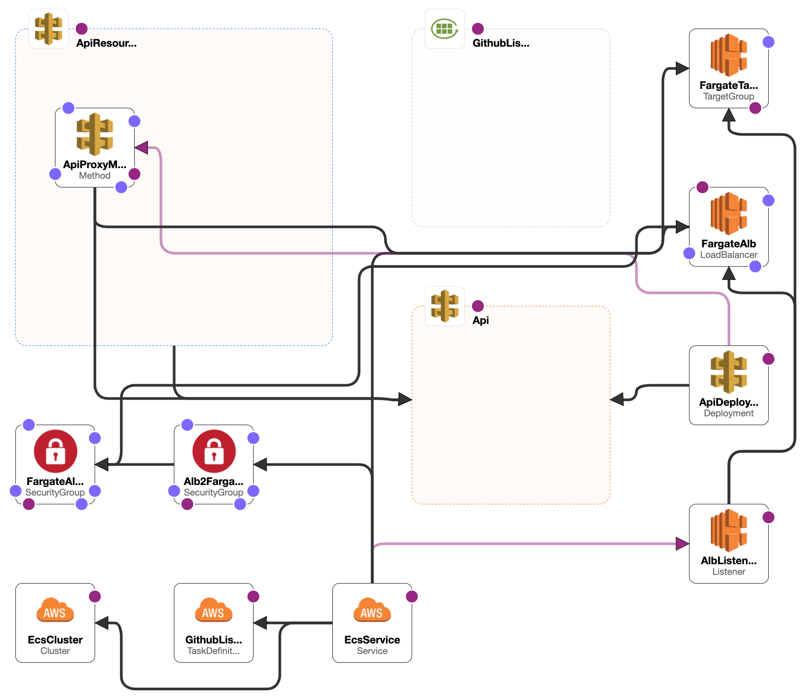
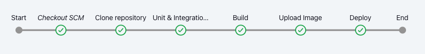

# GitHub Repositories Lister 

This project uses SpringBoot and Spring WebFlux 
to list the repositories of a user which are not forks
along with its branches.

## Building the application

To build application and package it as an executable jar, simply run

```shell
./gradlew clean check bootJar
```

You can find the generated jar in `./build/libs` 
with the name `github-lister-boot.jar`

## Running the application

To run the application, first you need to create a github access token. 
[Follow this guide to know more](https://docs.github.com/en/authentication/keeping-your-account-and-data-secure/creating-a-personal-access-token).

After you acquire an access token, you can either:

- Run the application without building by running

```shell
./gradlew bootRun \
    --args='--github.api.accessToken=<your-access-token>'
```

- Build the application then run the generated jar file using 

```shell
./gradlew java -jar \
    -D'github.api.accessToken=<your-access-token>' \
    ./build/libs/github-lister-boot.jar
```

## Packaging a containerized application

To build and publish the application as docker container, a `Dockerfile` is provided.

You can use the following command to create the container 
after replacing the `<image-name>` and `<image-tag>` with your values

```shell
docker build -t <image-name>:<image-tag> .
```

The docker file is using 2 stages, one for building and another one for the runnable container.
The order of the steps is important to minimize the number of layers that
needs to be re-created.

The first stage is using a base JDK container structured to : 

- Copy the required files for a gradle build 
- Download gradle and the dependencies using `./gradlew dependencies`
- Copy the application source code
- Build the application using `./gradlew bootJar`

The second stage is using a smaller base container with only the JRE structured to:

- Copy the built jar from the previous stage
- Create the entry point of the container
- Expose the `8080` port which is the server port

## Deploying to AWS using Cloudformation



To deploy the application to AWS, a cloud formation template `cf-stack.yaml` is created.

The template does not create a VPC or subnets. It uses the existing default VPC and subnets in the region for simplicity.

The cloudformation stack template creates the following resources:

- `GithubListerLogsGroup`:  A cloudwatch log group to collect the containers logs
- `EcsCluster`: A Fargate cluster to group the tasks and the services
- `GithubListerTask`: Task definition to configure an ECS container to start our image
  The template assigns `ExecutionRole` to the task, forwards the `GithubAccessToken` to the container
  and configures the task to use `GithubListerLogsGroup`
- `FargateAlbSG`: A security group for the load balancer to allow TCP connections on port `80`
- `Alb2FargateContainers`: Another security group to allow traffic from the load balancer to the task containers
- `FargateAlb`: An application load balancer to distribute the load on the tasks created by the service
- `AlbListener`: Listener on port `80` for the application load balancer
- `FargateTargetGroup`: A target group for the load balancer to route requests to the Fargate service on VPC
- `EcsService`: An AWS Fargate service that deploys 2 instances of the `GithubListerTask` and glues every thing together
- `Api`: An AWS APIGateway REST API definition to forward requests to our service
- `ApiResource`: APIGateway resource to receive requests
- `ApiProxyMethod`: APIGateway proxy that forwards all the requests to `FargateAlb`
- `ApiDeployment`: APIGateway deployment to create stage `dev` and deploy the API to it

You will need to provide the following parameters to be able to deploy the template.
You can either provide default values in the template or use `--parameter-overrides`
when deploying the template.

- `ExecutionRole`: This is used to give ECS service the permission to create tasks.
  See [here](https://docs.aws.amazon.com/AmazonECS/latest/developerguide/task_execution_IAM_role.html#create-task-execution-role)
  on how to create ECS task execution role
- `ContainerImage`: The full name of the application docker image.
- `GithubAccessToken`: The token that the application use to access GitHub APIs
- `AwsLogsGroup`: Logs group name that the app will create to retain the logs of the application
- `VpcId`: The id of the VPC in the region in which you are deploying the stack
- `SubnetOne`: The id of one of the subnets in the same VPC added before
- `SubnetTwo`: The id of another subnet in the same VPC added before

To deploy the template, you can use

```shell
aws cloudformation --region <aws-region> deploy --template-file cf-stack.yaml --stack-name <stack-name> --parameter-overrides file://<params-file-path>
```

To retrieve your a link to the deployed API Gateway use
```shell
 aws cloudformation list-exports --query "Exports[?Name==\`GithubListerStackApiGatewayUrl\`].Value" --output text --no-cli-pager
```

## CI/CD using Jenkins



A basic Jenkins pipeline was created to allow for continuous integration and deployment. 
It doesn't have automatic triggers or webhooks, you will need to run it manually

The pipeline does the following:

- Checks out the repository from GitHub 
- Runs unit & integration tests and archive the test results
- Builds container image
- Pushes container image to AWS ECR
- Deploys cloudformation stack template and prints the API Gateway URL

If you want to use Jenkins from Docker, a docker file is provided in `jenkins/Dockerfile` that will create 
a docker image with docker installed. It will use the docker daemon running on the host machine to create new containers.
These containers are not child containers but sibling containers, you can mount directories from the host machine to them. 
For more info check [here](http://jpetazzo.github.io/2015/09/03/do-not-use-docker-in-docker-for-ci/) 
and [here](https://medium.com/@manav503/how-to-build-docker-images-inside-a-jenkins-container-d59944102f30) 

To build the image and run the container use

```shell
docker build -t jenkins-docker:latest ./jenkins
docker run -v /var/run/docker.sock:/var/run/docker.sock -ti -d -p 8080:8080 -p 50000:50000 --restart=on-failure jenkins-docker
```

Before executing the pipeline, you need a docker agent on Jenkins, but if you are using the method
mentioned above of running Jenkins inside docker you should be fine

You will also need to install these plugins:  

- [Docker Pipeline](https://plugins.jenkins.io/docker-workflow/) 
  plugin installed for more control over using docker images.  
- [CloudBees AWS Credentials](https://plugins.jenkins.io/aws-credentials) 
  plugin installed for easy management of AWS credentials
- [Amazon ECR](https://plugins.jenkins.io/amazon-ecr) 
  plugin installed which integrates with AWS credentials plugin to manage uploading built container images to AWS ElasticContainerRegistry 

We will use AWS CLI docker image so that we can deploy our Cloudformation stack. 
For this purpose we will use the image [AWS CLI](https://hub.docker.com/r/amazon/aws-cli)

In order to run the pipeline, you will need to provide the following parameters either by replacing
them directly in the file or adding them to Jenkins global variables. 
See [here](https://www.baeldung.com/ops/jenkins-environment-variables#global-properties) for more info.

The parameters you need to provide are:

- AwsAccountId: Your AWS account Id.
- AwsRegion: The AWS region you would like to deploy to. 
  It must be the same region from which you will retrieve the VPC and the subnets
- AwsCfParamsFile: The path of the file that contains the overridden Cloudformation parameters
  The parameters need to be in one of the [supported formats](https://awscli.amazonaws.com/v2/documentation/api/latest/reference/cloudformation/deploy.html#supported-json-syntax)

After the pipeline finishes, you should have the stack up and running.
The API gateway URL should be shown in the output of the last stage